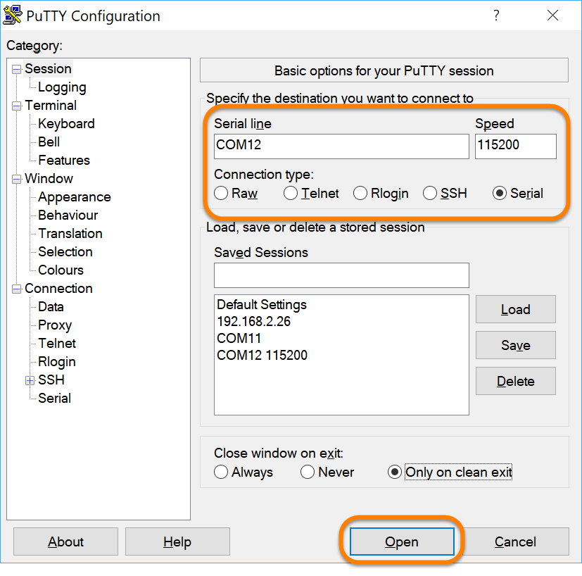

## Azure IoT Developer Kit Manual WiFi Configuration

To manually configure the WiFi SSID and Password on your Microsoft Azure IoT Developer Kit AZ3166 board rather than using the configuration Access Point, follow these steps:

1. Connect the board to your computer via the USB cable.

    

1. Put the Azure IoT Develper kit into Configuration mode, by holding down button A and while keeping it pressed down, press and release the reset button.  Finally release button A.

    

1. Once the board is rebooted, the OLED display on the board should report it's "id" and state that it is in configuration mode:

    

1. Determine the the serial port the board connected as. 

    - On Windows, open the device manager, and under the **"Ports (COM & LPT)"** heading find the entry for the **"STMicroelectronics Virtual COM Port (COMxx)"** and make note of the COM port shown.  For example in the screen shot below, you can see the board was connected on **COM12**.

        

    - On a Mac, you can see the list of attached serial devices by opening a terminal prompt and running:

        ```bash
        ls /dev/tty.*
        ```
    - In the list of displayed devices, locate the one with a name like:

        ```bash
        /dev/tty.usbmodemXXXX
        ```
    
1. Use a serial terminal to connect to your Azure IoT Dev Kit board at **115200** baud:

    - **On Windows**, you can use the terminal program of your choice.  If you don't have one, try [PuTTY](https://www.chiark.greenend.org.uk/~sgtatham/putty/latest.html).  Set the connection up as follows, and click the "**Open**" button.

        - Connection type: **Serial**
        - Serial line: **COMxx** (the COM port you discovered above)
        - Speed **115200**

         

    - **On Mac**, open a terminal prompt, and use the **screen** utility to connect to the serial port you discovered above at **115200** baud.  Replace the `/dev/tty.usbmodemXXXX` below with the serial port you discovered above:

        ```bash
        screen /dev/tty.usbmodemXXXX 115200
        ```

1. Once you are connected to the board via the serial terminal, you should see a help screen similar to the following (if not, you might try repeating the "Hold button A down while pressing and releasing the reset button" sequence from above to reset the board again):

    ```text
    ************************************************
    ** MXChip - Microsoft IoT Developer Kit **
    ************************************************
    Configuration console:
    - help: Help document.
    - version: System version.
    - exit: Exit and reboot.
    - scan: Scan Wi-Fi AP.
    - set_wifissid: Set Wi-Fi SSID.
    - set_wifipwd: Set Wi-Fi password.
    - set_az_iothub: Set the connection string of Microsoft Azure IoT Hub.

    #
    ```

1. The three commands of use here are "**scan**", "**set_wifissid**" and "**set_wifipwd**"

1. If you don't know the name of the SSID you need to connect to, you can can for available once by typing `scan` at the `#` prompt:

    ```text
    scan
    ```

    a list of available newtorks should be shown.  Find the one you want from that list, for example, in the output below, I can see "**MyWiFiNetwork**:

    ```text
    # scan
    Available networks:

      AWiFiNetwork
      AnotherWiFiNetwork..
      MyWiFiNetwork
      OtherWiFiNetwork
      SomeWiFiNetwork
    ```
1. To set the board to connect the WiFi SSID of your choice, from the `#` prompt in the serial terminal, run `set_wifissid` and pass your desired ssid in as an argument.  For example, to connect to the "**MyWiFiNetwork**" we discovered above, you would enter:

    ```text
    set_wifissid MyWiFiNetwork
    ```

1. Finally, you need to supply the password for your WiFi network.  To do so, from the `#` prompt, run `set_wifipwd` and include the password as an argument (if your network doesn't have a password, don't type one in)

    ```text
    set_wifipwd ********
    ```

1. Finally, to reset the board to normal behavior, from the `#` prompt, run `exit`:

    ```text
    exit
    ```

1. Once the board reboots, the board should ***briefly*** flash it's WiFi configuration on the OLED screen, and the "**Wi-Fi** led on the board should be solid green:

    